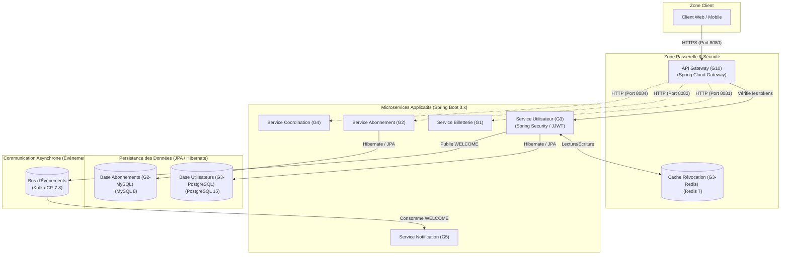
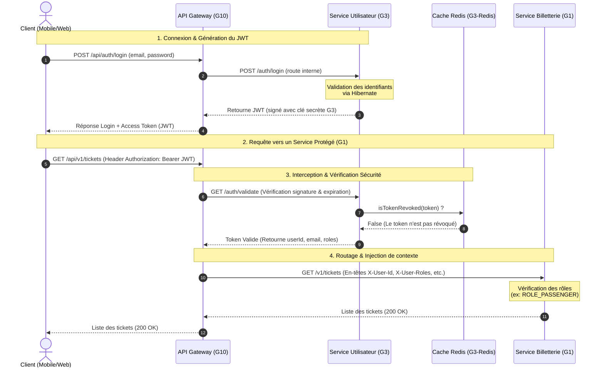

# SGITU — Cartographie & Diagrammes de l'Architecture Globale

Ce document présente la vision architecturale et physique du projet **SGITU**, illustrant comment les composants et frameworks (Spring Cloud Gateway, PostgreSQL, Hibernate, Redis, Kafka) s'articulent pour fournir un système robuste, sécurisé et à haute disponibilité.

---

## 1. Diagramme de Composants (Architecture Physique et Logique)

Le diagramme de composants suivant cartographie les différents conteneurs et les technologies utilisées par les groupes, ainsi que les flux de données et d'événements.

### Justification des choix technologiques et frameworks :
1. **Hibernate/JPA** : Utilisé pour la persistance des données relationnelles de G3 (PostgreSQL) et G2 (MySQL). Il garantit un couplage faible et évite d'écrire des requêtes SQL manuelles complexes en fournissant des abstractions de dépôt robustes (`JpaRepository`).
2. **Redis** : Choisi pour le stockage à haute performance (mémoire vive) de la liste noire des tokens révoqués lors de la déconnexion, offrant un temps d'accès sub-milliseconde.
3. **Kafka** : Assure le découplage asynchrone des services. Par exemple, lors de la création d'un utilisateur, G3 publie immédiatement un événement `WELCOME` sur Kafka. G5 (le service de notifications) le consomme à son propre rythme pour envoyer le mail de bienvenue, évitant ainsi d'impacter les temps de réponse de l'utilisateur.

---

## 2. Diagramme de Séquence UML (Authentification, Autorisation & Routage)

Ce diagramme présente le flux détaillé d'une requête envoyée par un utilisateur pour accéder à un service métier protégé (ex: la Billetterie de G1) après s'être connecté.

