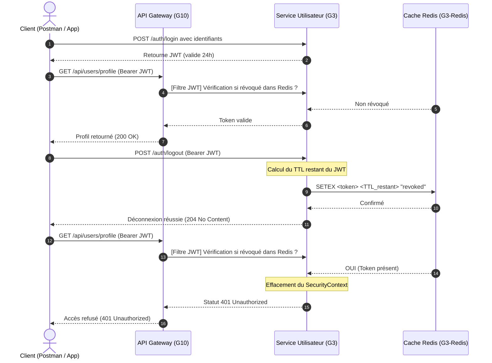

# SGITU — Spécification du Mécanisme de Révocation de Jetons (Sign-Out & Backstaging)

Ce document décrit la solution d'invalidation en temps réel des jetons d'accès JWT côté serveur (mécanisme de **Backstaging** ou **Blocklisting**) au sein du projet **SGITU**, en combinant le **Service Utilisateur (G3)** et le cache distribué **Redis**.

---

## 1. Problématique & Solution Stateless vs Stateful

Les jetons JWT sont intrinsèquement **stateless** (sans état) : une fois émis par le Service Utilisateur (G3), ils restent valides jusqu'à leur date d'expiration technique, même si l'utilisateur s'est déconnecté (Sign-Out) ou si son compte a été désactivé par un administrateur.

Pour résoudre ce problème de sécurité critique sans perdre les performances du stateless, nous implémentons un mécanisme de **liste noire de tokens révoqués basée sur Redis**.



---

## 2. Rôles et Responsabilités

### A. Le Service Utilisateur (G3) — Émetteur & Source de Vérité
- **Émission** : Lors de la connexion (`POST /auth/login`), G3 génère le jeton JWT.
- **Révocation (Logout)** : Lors de la déconnexion (`POST /auth/logout`), G3 extrait le token, calcule son temps de vie restant (TTL) et l'enregistre dans Redis comme révoqué.
- **Validation** : Pour chaque requête entrante authentifiée, le filtre `JwtFilter` de G3 interroge Redis pour vérifier l'absence du token dans la liste noire.

### B. Le Cache Redis — Stockage Éphémère Ultra-Rapide
- Stocke les jetons révoqués sous forme de clés `String` avec une durée de vie (TTL) égale au temps restant avant l'expiration naturelle du jeton.
- Une fois le TTL expiré, Redis supprime automatiquement la clé, libérant ainsi la mémoire.

---

## 3. Configuration & Résilience technique

### A. Paramètres de Connexion (Spring Boot / Lettuce)

Dans `application.properties` du Service Utilisateur :
```properties
# Configuration Redis (Lettuce)
spring.redis.host=${SPRING_REDIS_HOST:localhost}
spring.redis.port=${SPRING_REDIS_PORT:6379}
```

### B. Haute Disponibilité et Tolérance aux Pannes (Resilience / Fail-safe)

Pour éviter que le service utilisateur ou l'authentification ne s'effondre en cas d'indisponibilité de Redis (panne réseau, crash du conteneur), le filtre `JwtFilter` implémente un mécanisme de **graceful fallback** (rupture douce) :
1. Si Redis répond normalement : le token est vérifié.
2. Si Redis échoue (ex: `RedisConnectionFailureException`) : l'erreur est logguée en `ERROR` mais la requête **n'est pas bloquée**. Le système passe directement à la validation classique de la signature cryptographique du JWT. Cela garantit une **disponibilité à 99.9%** de la plateforme.

---

## 4. Maintenance & Diagnostic

### Comment vérifier les tokens dans Redis en ligne de commande ?

1. Connectez-vous au conteneur Redis :
   ```bash
   docker exec -it g3-redis redis-cli
   ```
2. Lister toutes les clés des tokens révoqués actuellement :
   ```redis
   KEYS *
   ```
3. Obtenir le temps restant en secondes avant l'invalidation automatique du token :
   ```redis
   TTL <votre_token_jwt>
   ```
